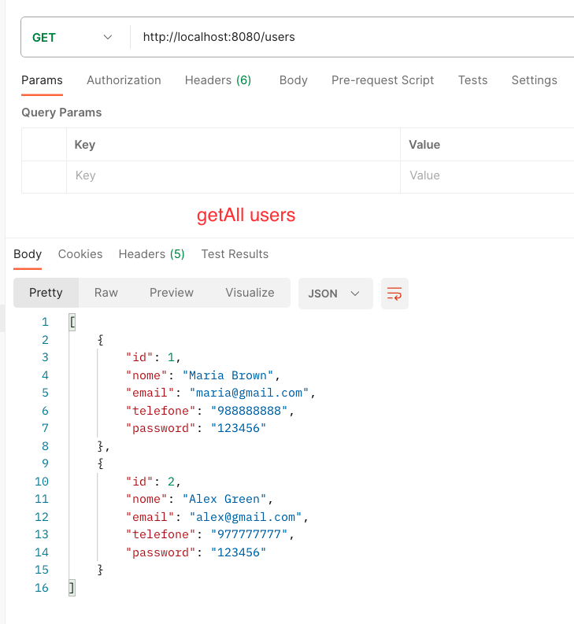
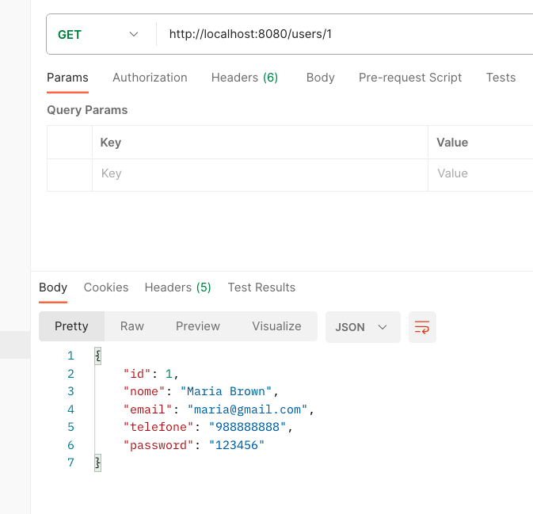
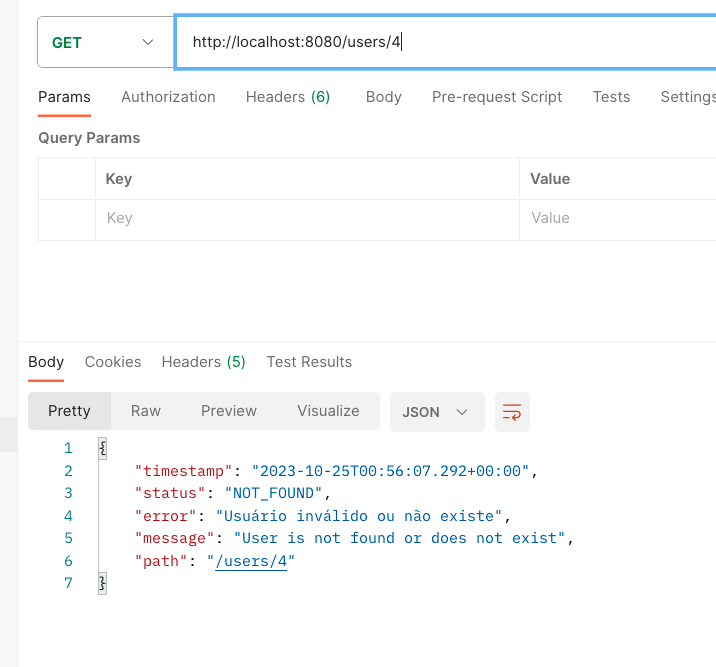
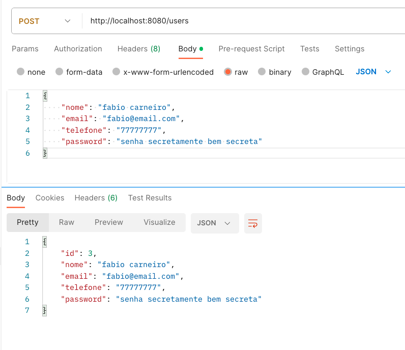
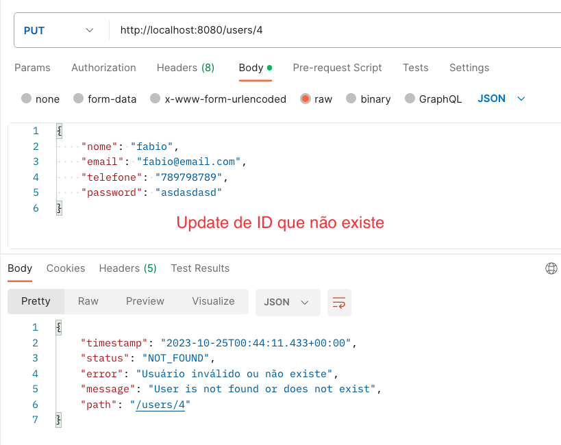
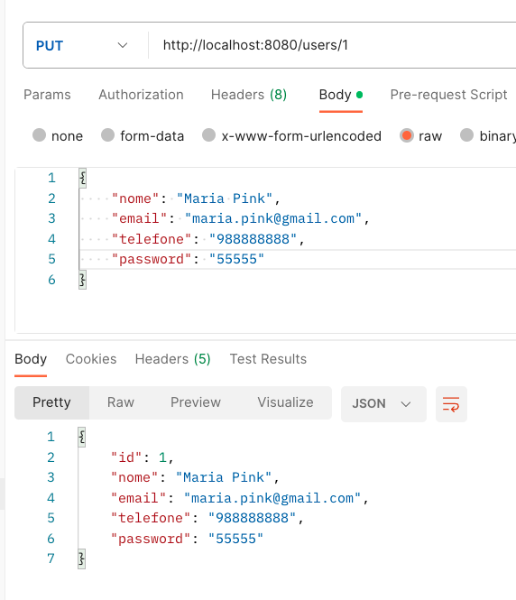

## Projeto - Portfólio de aula prática: Desenvolvimento web
### Universidade Anhanguera Educacional de Campinas

### Aluno: Fabio Carneiro

`
O Trabalho envolve o exercício de construir uma API usando
a linguagem Java utilizando o Framwork Springboot com os 
seguintes requerimentos:
`

* Criar projeto Spring Boot Java
* Implementar modelo de domínio
* Estruturar camadas lógicas: resources, service, repository
* Confifurar o banco de dados de teste (H2)
* Povoar o banco de dados
* CRUD - Create, Retrieve, Update, Delete
* Tratamento de excessões
* Usar a IDE Spring Tool 4 para desenvolvimento
* Usar a ferramenta Postman para testes da API

### Images dos testes elaborados no Postman:

## Fabio Carneiro - 24/10/2023